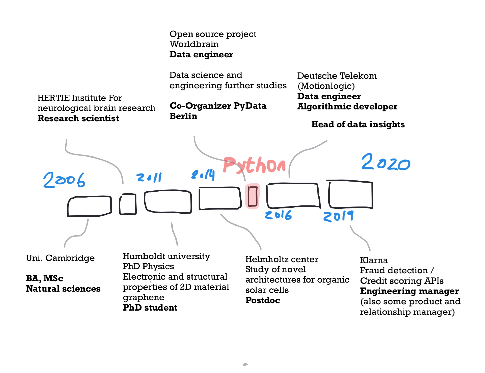

## Me in a sketch

## Me in text
I have done research in **biophysics** - investigating the proton pumping mechanism in bacteriorhodopsin [phase separation in proteins](https://www.academia.edu/1107753/Liquid-Liquid_Phase_Separation_in_Protein_Solutions_Controlled_by_Multivalent_Salts_and_Temperature).

Then I moved to neuroscience for some time where I studied signal correlations in the brains of rodents for potential treatment of Parkinson's disease.

I have been a researcher in solid state physics, focusing on graphene as a new nanomaterial and [organic solar cells](https://www.sciencedirect.com/science/article/abs/pii/S0040609019302780). My research involved a lot of fabrication of nanolayers using Ultrahigh vacuum techniques and spectroscopic analysis. [Here](https://scholar.google.com/citations?user=i7TBNSMAAAAJ&hl=en) you can find more about my research.

I have then moved outside academia to data engineering and data science roles.    
Some things I have built are:
- a tool written in *python* orchestrating the production data pipeline
- a module (again in *python*) extracting data from a production pipeline using json files
- a model predicting subway traffic based on mobile signaling data (yet again in *python*)

I really enjoy building and leading teams:
- I have built and led a team of 4 data scientists at Motionlogic - Deutsche Telekom. We designed and improved algorithms for traffic analysis using spatial and mobile signaling data.    
- I have led a team of 5 software engineers/data scientists at Klarna in building and improving fraud detections systems.
- I have built and led a team of 12 software engineers/data scientists at Klarna in building low-latency APIs 

## Some public talks I gave:
[Mapping with Folium](https://www.meetup.com/Python-Users-Berlin-PUB/events/xmdjfmywpbmb/) (Python Users Berlin)

[Introduction to (Py)Spark](https://www.meetup.com/fr-FR/PyData-Cyprus/events/259617209/) (PyData Cyprus)
